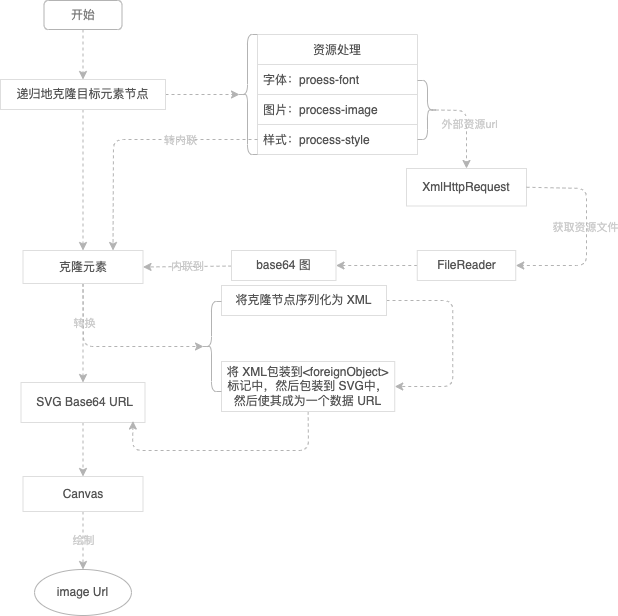

# ts-dom-to-image
 <p>
  <a href="https://www.npmjs.com/package/ts-dom-to-image"></a>
  <a href="https://www.npmjs.com/package/ts-dom-to-image"></a>
  <a href="https://github.com/huangjihua/ts-dom-to-image"></a>
  <a href="https://www.npmjs.com/package/ts-dom-to-image"></a>
</p>
## 简介
ts-dom-to-image 是一个用 typeScript 编写的库，它可以将任意的 DOM 节点转换为矢量(SVG)或栅格(PNG 或 JPEG)图像。它基于 Paul Bakaus 的 [domvas](https://github.com/pbakaus/domvas)，已经被完全重写，修复了一些 bug，增加了一些新功能(比如 Web 字体和图像支持)。

# 安装
**NPM**
> npm install ts-dom-to-image

> 提供输出umd,cjs,es 3种形式的包

```js
/* in ES 6 */
import domtoimage from 'ts-dom-to-image';
/* in ES 5 */
var domtoimage = require('ts-dom-to-image');
```

**Bower**
> bower install dom-to-image

在页面中包含 src/dom-to-image. js 或 dist/dom-to-image.min.js，它将使 实例化DomToImage类，通过实例化对象即可调用相关函数。

```html
<script src="path/to/dom-to-image.min.js" />
<script>
  domtoimage.toPng(node)
  //...
</script>
```
# 用法

所有顶级函数都接受 DOM 节点和呈现选项并返回 promise，这些 promise 通过相应的数据 URL 来实现。获取 PNG 图像 base64编码的数据 URL 并立即显示:

```js
var node = document.getElementById('my-node');
window.domtoimage = new DomToImage({targetNode:node,bgColor:'#fff'}); 

domtoimage.toPng()
    .then(function (dataUrl) {
        var img = new Image();
        img.src = dataUrl;
        document.body.appendChild(img);
    })
    .catch(function (error) {
        console.error('oops, something went wrong!', error);
    });
```
获取一个 PNG 图像块并下载它(例如，使用 FileSaver) :
```js
domtoimage.toBlob()
    .then(function (blob) {
        window.saveAs(blob, 'my-node.png');
    });
```
保存并下载一个压缩的 JPEG 图片:
```js
domtoimage.toJpeg()
    .then(function (dataUrl) {
        var link = document.createElement('a');
        link.download = 'my-image-name.jpeg';
        link.href = dataUrl;
        link.click();
    });
```
获取一个 SVG 数据 URL，但过滤掉所有 < i > 元素:
```js
 new DomToImage({targetNode:node,bgColor:'#fff',filter:node=>node.tagName !== 'i'}); 
```
以 Uint8Array 的形式获取原始像素数据，每4个数组元素表示一个像素的 RGBA 数据:
```js
var node = document.getElementById('my-node');

domtoimage.toPixelData(node)
    .then(function (pixels) {
        for (var y = 0; y < node.scrollHeight; ++y) {
          for (var x = 0; x < node.scrollWidth; ++x) {
            pixelAtXYOffset = (4 * y * node.scrollHeight) + (4 * x);
            /* pixelAtXY is a Uint8Array[4] containing RGBA values of the pixel at (x, y) in the range 0..255 */
            pixelAtXY = pixels.slice(pixelAtXYOffset, pixelAtXYOffset + 4);
          }
        }
    });
```
Impl 下的所有函数都不是公共 API，只是为了单元测试而公开。

# options 渲染选项

 
| 属性 | 类型 | 默认值 | 说明
| --- | --- | --- | --- |
| targetNode| HTMLElement | 生成图片的目标元素 |
| width | number | -- |呈现前应用于节点的高度和宽度(以像素为单位)|
| height | number | -- |呈现前应用于节点的高度和宽度(以像素为单位)|
| bgcolor | string | -- |设置背景色，CSS 颜色值 |
| style | CSSStyleDeclaration | -- | 样式属性对象 |
| filter | function | -- |一个以 DOM 节点为参数的函数。如果传递的节点应该包含在输出中，那么应该返回 true (排除节点意味着也排除它的子节点)。未在根节点上调用|
| quality  | number | 1.0 | 一个介于0和1之间的数字，表示 JPEG 图像的图像质量(例如0.92 = > 92%) |
| imagePlaceholder | string | -- |占位符图像的数据 URL，在获取图像失败时将使用该 URL。默认值为未定义，并将对失败的映像抛出错误|
| cacheBust | boolean | false |设置为 true 可将当前时间作为查询字符串追加到 URL 请求以启用缓存崩溃 |
| useCredentials | boolean | false | 对外部 URI（CORS 请求）使用（现有）身份验证凭据 |
| httpTimeout | number | 30000 | 设置 resolve 超时时间，单位单位秒 |
| useCredentials | boolean | false | 对外部 URI（CORS 请求）使用（现有）身份验证凭据 |
| scale | number |  window.devicePixelRatio | 自定义图像缩放比例 |

# 依赖性
 
 当前只是使用标准库，但要确保浏览器支持：
 - Promise 
 - SVG<foreignObject> 
# 流程图

# 注意事项 

 - 如果你想呈现 DOM 节点包含一个带有绘制内容的 canvas 就可（画布受到污染情况除外）
 - ISO中对元素的crossOrigin属性不支持，本解决方案采用XmlHttpRequest拿到资源并通过FileReader转换成Base64。